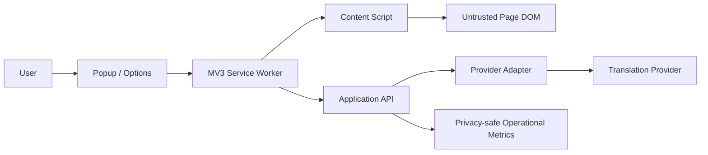
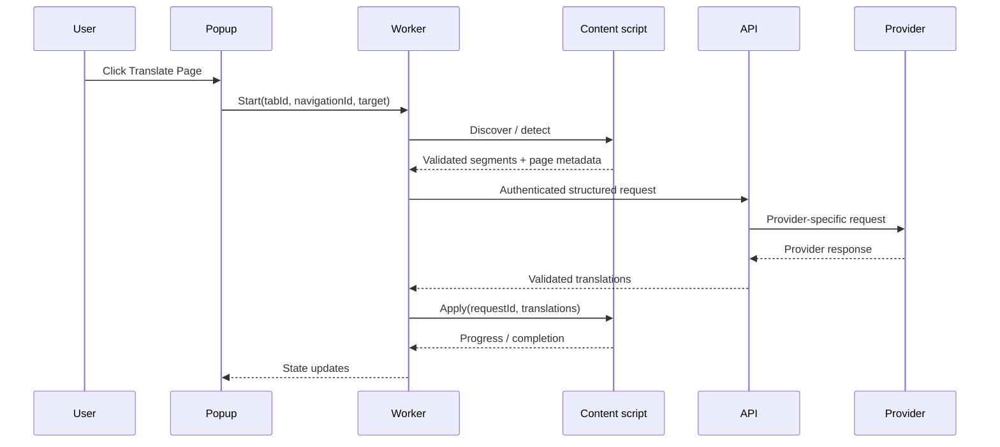

# Architecture

Status: provisional baseline from Milestone 0

## Decisions

- Extension framework: WXT + React + TypeScript, targeting Chrome MV3 first.
- API runtime: Cloudflare Workers + Hono.
- Workspace: pnpm monorepo.
- Validation: shared Zod-style runtime schemas; types are inferred from schemas where practical.
- Testing: Vitest and Playwright with local fixtures.
- Provider boundary: `TranslationProvider` interface. DeepL is the first real adapter candidate; the mock provider is required first.
- Authentication: loopback-only local development path initially; staging/production require short-lived revocable application sessions before public release.

Detailed rationale is in `docs/decisions/`.

## System context



The page is untrusted. The content script may read and mutate only the DOM needed for an explicit translation request. The service worker owns extension orchestration, tab/session identity, cancellation, backend requests, and extension storage. The API owns authentication, quotas, limits, provider credentials, provider calls, and operational logging.

## Package boundaries

```text
/
  apps/
    extension/             WXT entrypoints, popup/options, worker, content engine bridge
    api/                   Worker routes, auth, quotas, provider orchestration
  packages/
    shared-types/          Public domain types and discriminated unions
    shared-validation/    Runtime schemas and safe parsers
    translation-core/     DOM-independent segmentation, batching, cache, response mapping
    translation-providers/ Provider interface, mock, DeepL adapter, provider error mapping
    shared-config/        Environment and feature-flag validation
    ui/                   Accessible design tokens and reusable React primitives
    testing/              Fixtures, factories, fake clocks, browser helpers
  docs/
```

Rules: core has no browser/provider/UI imports; providers have no DOM/UI imports; API has no direct DOM access; UI has no secrets; extension code never imports provider SDKs.

## Extension runtime design

- Popup uses `chrome.runtime.sendMessage` to ask the service worker for tab state and to start/cancel/restore.
- The service worker validates sender, tab ID, frame ID, navigation identity, request ID, and payload schema before acting.
- The content script receives a command only after the service worker confirms the active tab and supported URL. It reports progress and structured errors.
- The DOM engine stores originals in an in-memory session keyed by page session and node identity. A future persistence layer must remain opt-in and privacy-reviewed.
- Dynamic content is handled by a debounced observer after the primary translation session; extension mutations are marked and ignored.

## API runtime design

Hono provides small route composition and Web-standard request/response handling. Middleware order: request ID, CORS allowlist, method/content-type checks, auth, rate limits, payload validation, route handler, normalized error response, privacy-safe logging. Provider calls use `fetch` with an abort timeout and only a narrow allowlisted upstream URL.

## Storage model

Milestone 1 stores only settings needed by the shell. MVP translation content remains memory-only by default. Future account data is separate from local settings. Any persistent translation memory must have explicit opt-in, size limits, clear action, and cache-key versioning.

The local release-candidate workflow builds an unpacked production extension, starts the API on `127.0.0.1`, and keeps provider selection in the backend environment. The extension can export metadata-only diagnostics without page text or URLs.

## Data-flow sequence



## API-key boundary

The extension bundle may contain only `VITE_API_BASE_URL`. Provider keys and server administrator keys are backend secrets. The API must reject client-supplied provider/model/endpoint overrides except for explicitly allowlisted product configuration. Secret scanning covers source, history where practical, bundles, source maps, logs, and configuration.
